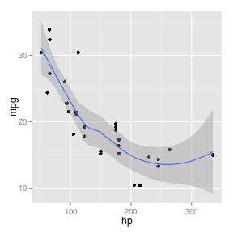

# Semana 01

Hola, hola... esto es una **negrita** y esto es una _cursiva_. Los enlaces se indican [así](http://r-es.org) y la manera de ejecutar código de R se explica en los siguientes párrafos:

We explain the idea with a trivial example: suppose we need to write the value of $2\pi$ into a report; of course, we can directly write the number $6.28$. Now if I change my mind and I want $6\pi$ instead, I may have to find a calculator, erase the previous value and fill in the new one. Since it is extremely easy for the computer to calculate $6\pi$, why not leave this job to the computer completely and free the man of the labor work? What we need to do is to leave the source code in the document instead of a hard-coded value, and tell the computer how to find out the source code. Usually we use special markups for computer code in the source report, e.g. we can write `'the value is '`, in which `` is a pair of marks that tell the computer `6 * pi` is source code and should be executed.

If you know a dynamic web language such as PHP (can mix HTML and PHP code together), the above idea should look familiar. The above example shows the _inline_ code output, which means source code is mixed inline with a sentence. The other type of output is the _chunk_ output, which gives the results from a whole block of code. The chunk output has much more flexibility; for example, we can produce graphics or tables from a code chunk. Here is a plot created with **ggplot2** dynamically:


```r
library(ggplot2)
qplot(hp, mpg, data = mtcars) + geom_smooth()
```

 


And here is a table created with the **xtable** package:


```r
library(xtable)
xtable(head(mtcars[, 1:5]))
```

% latex table generated in R 2.15.1 by xtable 1.7-0 package
% Sun Aug  5 18:06:27 2012
\begin{table}[ht]
\begin{center}
\begin{tabular}{rrrrrr}
  \hline
 & mpg & cyl & disp & hp & drat \\ 
  \hline
Mazda RX4 & 21.00 & 6.00 & 160.00 & 110.00 & 3.90 \\ 
  Mazda RX4 Wag & 21.00 & 6.00 & 160.00 & 110.00 & 3.90 \\ 
  Datsun 710 & 22.80 & 4.00 & 108.00 & 93.00 & 3.85 \\ 
  Hornet 4 Drive & 21.40 & 6.00 & 258.00 & 110.00 & 3.08 \\ 
  Hornet Sportabout & 18.70 & 8.00 & 360.00 & 175.00 & 3.15 \\ 
  Valiant & 18.10 & 6.00 & 225.00 & 105.00 & 2.76 \\ 
   \hline
\end{tabular}
\end{center}
\end{table}


